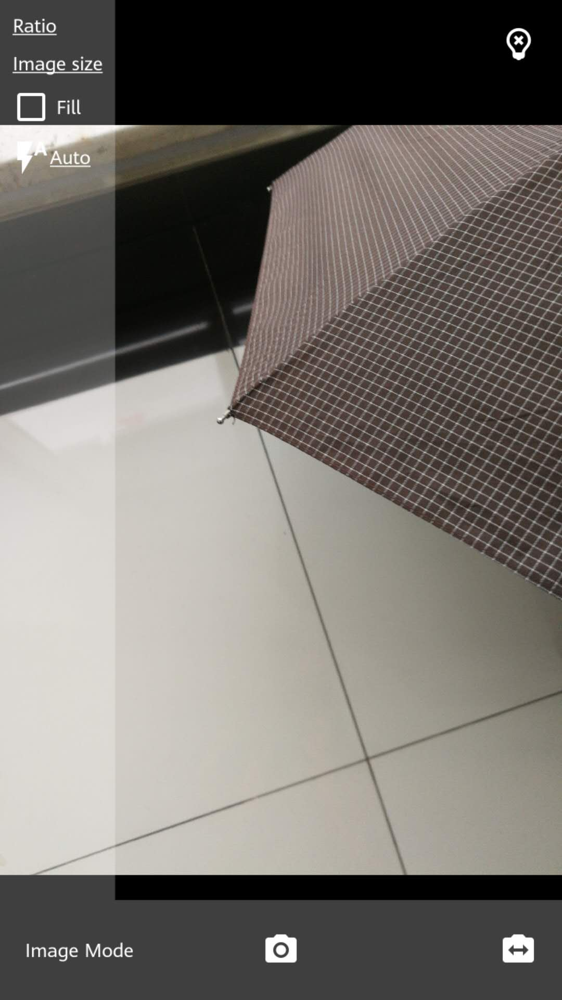
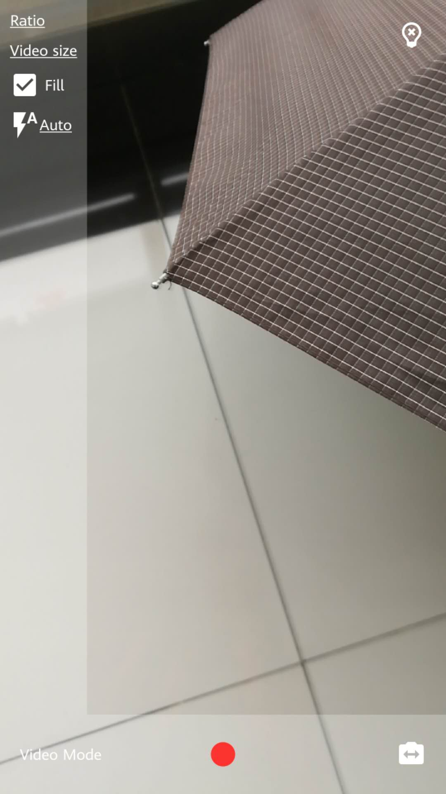

# Camera

Use android camera to take pictures and videos, based on [camera2](https://developer.android.com/reference/android/hardware/camera2/package-summary) api.

 

## Features

* Auto filled `CameraView` for previewing
* Support both image capture & video record
* Configurable audio/video size and aspect ratio, auto focus, tap to focus, flash control, etc.

## Usage

* Add `CameraView` into your layout xml:

```xml
<top.defaults.camera.CameraView
    android:id="@+id/preview"
    android:layout_width="wrap_content"
    android:layout_height="wrap_content"
    android:layout_centerInParent="true"
    app:mode="video"
    app:aspectRatio="4:3"
    app:autoFocus="true"
    app:facing="back"
    app:fillSpace="false"
    app:flash="auto"
    app:showFocusIndicator="true"/>
```

> See [`top_defaults_camera_attrs.xml`](./camera/src/main/res/values/top_defaults_camera_attrs.xml) for all supported attributes.

* Create a `Photographer` with the `CameraView`:

```java
@Override
protected void onCreate(@Nullable Bundle savedInstanceState) {
    super.onCreate(savedInstanceState);
    
    // ...

    CameraView preview = findViewById(R.id.preview);
    photographer = PhotographerFactory.createPhotographerWithCamera2(this, preview);
    
    // ...
}
```

* Implement and set `Photographer.OnEventListener` to receive events from the camera:

```java
    photographer.setOnEventListener(new Photographer.OnEventListener() {
        @Override
        public void onDeviceConfigured() {}

        @Override
        public void onPreviewStarted() {}

        @Override
        public void onPreviewStopped() {}

        @Override
        public void onStartRecording() {}

        @Override
        public void onFinishRecording(String filePath) {}

        @Override
        public void onShotFinished(String filePath) {}

        @Override
        public void onError(Error error) {}
    });
```

* Start/stop preview in `onResume()`/`onPause()`:

```java
    @Override
    protected void onResume() {
        super.onResume();
        photographer.startPreview();
    }

    @Override
    protected void onPause() {
        photographer.stopPreview();
        super.onPause();
    }
```

* `PhotographerHelper` is your friend:

```java
photographerHelper = new PhotographerHelper(photographer); // init with photographer
photographerHelper.setFileDir(Commons.MEDIA_DIR); // set directory for image/video saving
photographerHelper.flip(); // flip back/front camera
photographerHelper.switchMode(); // switch between image capture/video record
```

See a complete usage in the app sample code.

## References

* [google/cameraview](https://github.com/google/cameraview)
* [googlesamples/android-Camera2Basic](https://github.com/googlesamples/android-Camera2Basic)
* [googlesamples/android-Camera2Video](https://github.com/googlesamples/android-Camera2Video)

## License

See the [LICENSE](./LICENSE) file.